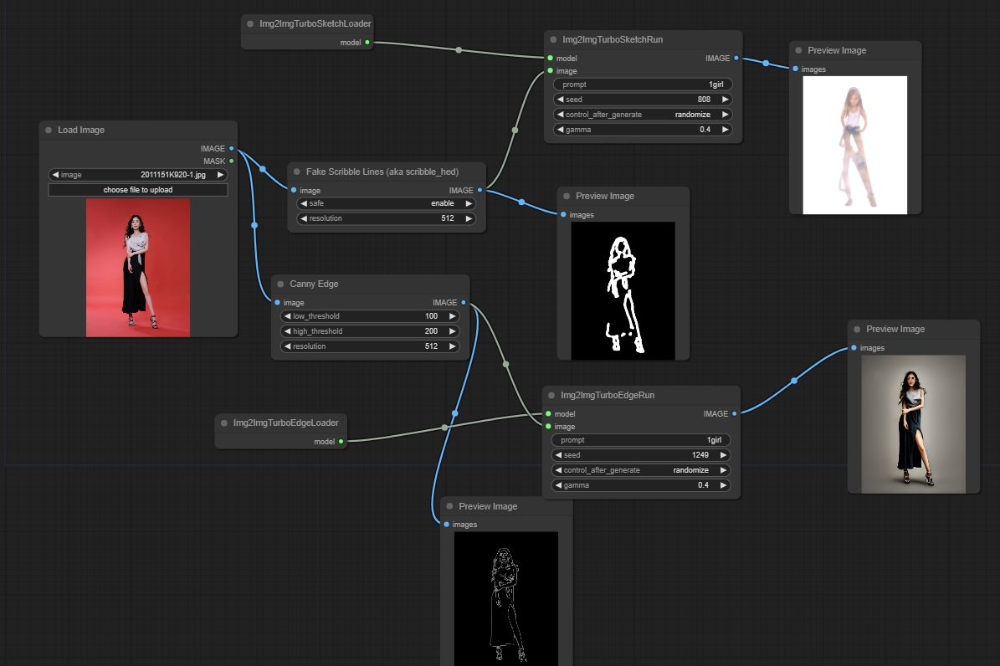
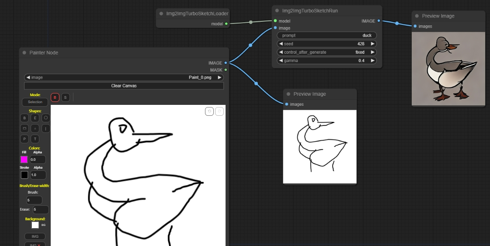

# ComfyUI-Img2Img-Turbo

## Examples

### base workflow

https://github.com/chaojie/ComfyUI-Img2Img-Turbo/blob/main/wf.json

### painter workflow

https://github.com/chaojie/ComfyUI-Img2Img-Turbo/blob/main/wf_painter.json

## img2img-turbo

[img2img-turbo](https://github.com/GaParmar/img2img-turbo)

如果安装其他node更新了diffusers版本，需要pip install 'diffusers>=0.24.0,<=0.25.1' 再安装回来
